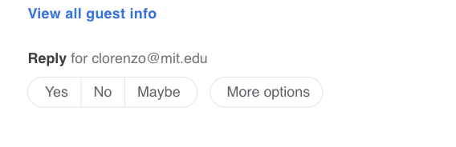
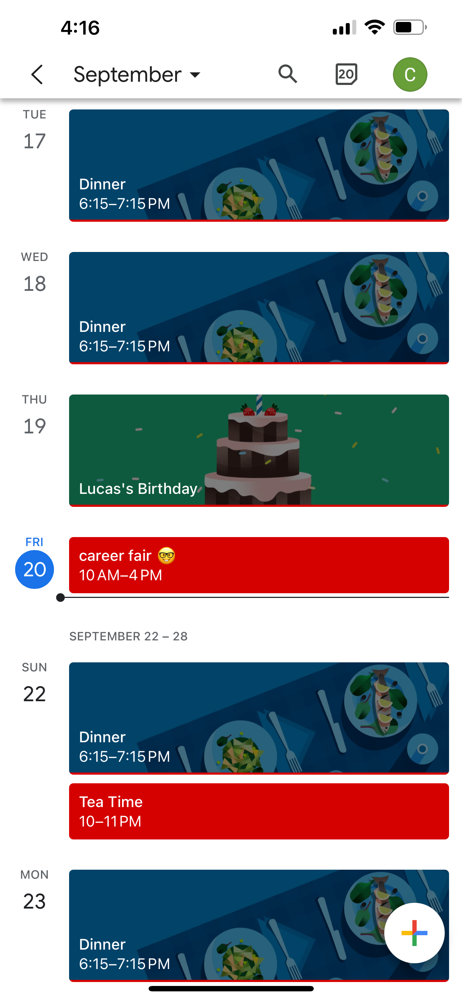
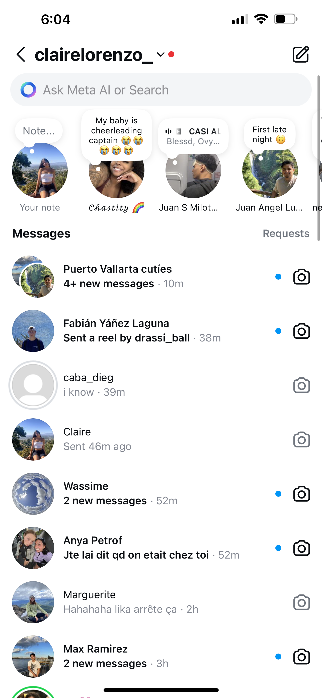
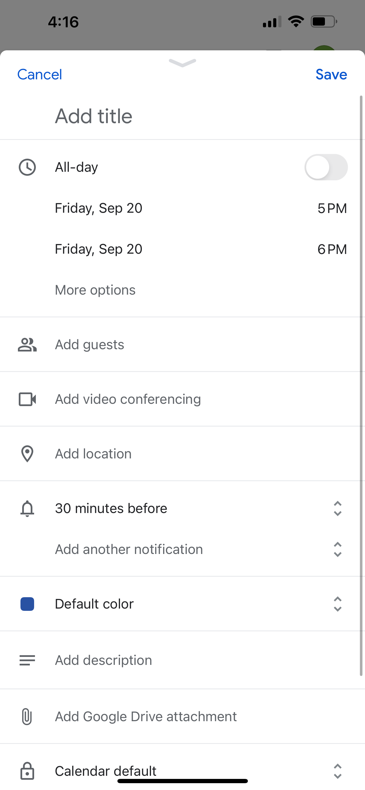
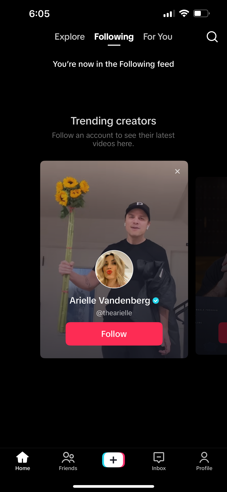
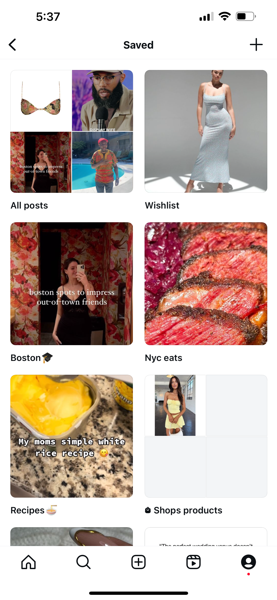
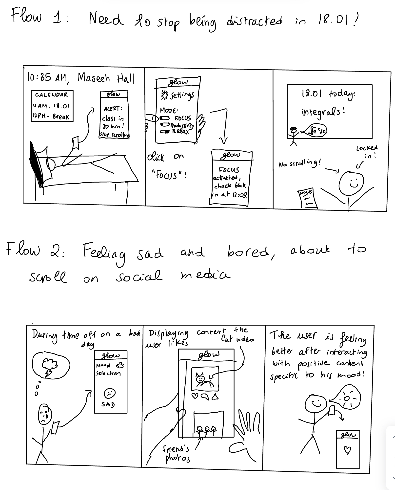

# Assignment 2

## Broad application goals
From my need finding assignment, I know that I want to target students or young professionals who want to be able to connect with friends and find entertainment within social media, but who have a lot of responsibilities and need accountability to stick to their schedules and keep their productivity levels up. More specifically, this app is meant for people who struggle to get off social media, who feel some type of social media addiction, of who struggle with being chronically online and constantly comparing themselves to what they see online. The value this app is bringing is entertainment, content of all types (lifestyle, sports, beauty, comedy…) with less toxicity and potential for addiction associated to this entertainment.  It would be a scrolling based app similar to Instagram and TikTok but with added positivity and productivity features.\
The name for my app would be Glow, to reflect the wellness/positivity aspect of the application.

## Scrapbook of comparables

### Image 1: Adding event to calendar

{:width='500'}
 

This feature is coming from outlook mail and outlook calendar, where you are prompted to add an event to your calendar when someone invites you to an event. This could be helpful to my brainstorming because I had not considered actually having people send social event invites through my app . If an other user is inviting people to a social event on Glow, there could be an option to simply add it to the productivity schedule of the day, which could sync to a linked calendar app if applicable.
\
### Image 2: Current time line in calendar day view
{:width='300'}

This is coming from the google calendar, where you can see all the events you have for the day in one screen, with a line at the time where we are currently at, so we can track what is coming up next. This could be helpful for the productivity tracking side of my app, where I would want a tab with a calendar like view of events to reduce distractions during these events and set reminders / usage limits.

### Image 3: Direct messages, Instagram
{:width='300'}
I like instagram DMs because it is very clear which conversations are opened, which are not, and how many messages you have to catch up on. I think having a feed for each group chat would be very cool (on top of having messages and posts sent), could be a separate icon on each conversation, but would have to brainstorm more on how exactly that would work.

### Image 4: Creating a new event
{:width='300'}
This is once again coming from the google calendar app, I would want to be able to add times (even if a calendar has been synced) where I do not want to be be scrolling on social media, with a name for the event/time, a length of time (start time, end time), and any additional comments or special features during this time (maybe allowed to only get notifications from certain people, etc)

### Image 5: Different Feeds
{:width='300'}
This is coming from TikTok. In this photo, you can see that you can select three different feeds: Following, Explore, and For You. To improve positivity on the app, I am considering maybe having several feeds for different moods, or potentially just having a mood selector that prompts you to input how you feel, and based on how you classified certain posts on how they made you feel previously, would suggest content. Also maybe could scroll through feeds that are shared with other people in this way to increase connection with other users?

### Image 6: Saving posts into collections
{:width='300'}
I love the Instagram feature where you can save posts into different collections, would also be nice to be able to have a review button similar to the save button on instagram, where you could classify posts on how they make you feel (don't want to see content like this, love content like this, content that makes me feel motivated, content that makes me happy, sad, etc) for the mood-based feed functionality.

### Image 7: Thoughts / Goals
 {:width='300'}
I don't like instagram thoughts, but I like that they are above the messages. At the top of the messages view, there could be a goals tab to click on, where you could go into a list of people's goals for the day (if they are sharing with you), explained in the feature brainstorming.

## Brainstorming feature ideas

1- Schedule Input : An input schedule box where you can add weekly times you are busy with things during which you don’t want to be active on social media (work, classes, outings with friends) \
2- Schedule Viewer: A side bar on the left side (collapsible) that shows your schedule and the current moment in the day\
3- Post reactions : A like, save, and comment button for posts with no like counts with options to save posts into collections\
4- Group Chat Content Classification: Group chats and direct messaging with the possibility of classifying videos and photos into categories within the chat\
5- Productivity based scrolling time limits: A daily limit automatically set for users, that can be adjusted depending on your goals \
6- Mood based filtering: content could be filtered based on input from the user, such as their mood, or a specific topic they want to see or hear about \
7- Post reviewing: A review button on posts to suggest more posts like that one, less posts like that one, or place them in a mood category\
8- Productivity Modes:  Different productivity modes controlled by a mode button (productivity mode – maybe only messaging is allowed, relax mode, where entertainment content is able be seen, or busy/focus mode, where no functionality is included)\
9- Daily goal setting: Goal setting feature where reminders are sent over the course of the day when the user is using the app\
10- Wellness and Productivity Time: Tab for viewing time spent on different things withing the app that day\
11- Productivity tracking: Productivity tracking tab, where users can track in more detail how productive they have been over time (for example, how long they spent in productivity mode, or how long they were in focus mode, etc).\
12- Wellness Popups: Suggestion popups when users use the app a lot (for example, an alert if a user is using the app for longer period of time then usual, or an alert when they have something planned in 30 minutes)\
13- Motivational Circle Selection: User settings to place friends and family in a priority category so their posts come up first in their feed, or receive notifications from them even in certain modes.\
14- Automatic calendar sync: Possibility to sync another online calendar, such as google calendar or apple calendar, for seamless usage\
15- Public Goals: Possibility to share goals inputted to the app with specific friends for accountability in the same tab, and comment on each other’s accomplishments. Other goals can only be shown to user that created them.\
16- Centralized settings : One tab in the app where you can control all settings including productivity setting, privacy settings (which friends should be in your motivational circle, basic app settings, etc)
17- Event sharing: Options to share calendar for specific day to certain friends when needed, or add something to their calendar
18- Event pubbing: Feature to create new event and posts advertising for it on your page, so people can add it to their calendar
19- Calendar upload: Social events added into the app calendar can in turn be uploaded to the synced calendar linked by the user (google calendar, apple calendar, etc)
20- Able to modify or change events on the calendar side bar on the left hand side of the app, mentioned in feature 2.

## VSD analysis
### Prompt Answers:

#### Stakeholders
##### Direct Stakeholders – Active Users
Observation: Mostly, the direct stakeholders would be creators and users, including students, young professionals, or even parents seeking to balance social interaction and productivity.\
Design Response: Ensure features like the focus mode and timers for times where productivity is needed and customizable notifications that are flexible enough to cater to different user needs based on their roles (for example, students needing class-time lockout vs. professionals requiring meeting-time restrictions).

##### Variation in Ability – Accessibility Features
Observation: Users with limited vision or hearing might struggle with certain things like viewing images, hearing notifications, and motor impairments may limit the ability to using swiping in the interfaces.\
Design Response: Introduce accessibility options such as voice commands, text-to-speech for notifications, and adjustable contrast and font sizes for users with vision impairments or color blindness. These adjustments might create a more inclusive environment withing the application.

#### Time

##### Adaptation – Supporting Lifestyle Changes
Observation: Users might use the app during certain lifestyle changes like reducing screen time or improving social connections. However, features like having the app unavailable for certain periods of time could discourage social interaction, even when users might benefit from light engagement within the application.
Design Response: Offer customizable “social breaks” or allow for customizing the focus and productivity modes that let users have short, guilt-free interactions while maintaining productivity goals. This will help keep a balance between lifestyle change and maintaining social ties.

#### Pervasiveness

Observation: As the app grows towards having more users, interactions may become less personal and users might start prioritizing engagement with large audiences and "fame" or to be "trending" rather than more meaningful connections.
Design Response: Add features that prioritize personal relationships, like the motivation circle and add features to post and share within smaller groups.
#### Values
Value Tensions – Autonomy vs. Accountability
Observation: Autonomy in setting focus timers might conflict with the desire to be held accountable by friends or family. For instance, a user may not want others to know they’ve overridden their focus sessions.
Design Response: Provide optional transparency where users can choose if friends can see their focus override activity, balancing accountability and personal autonomy.``

### Storyboarding and sketching

{:width='600'}
