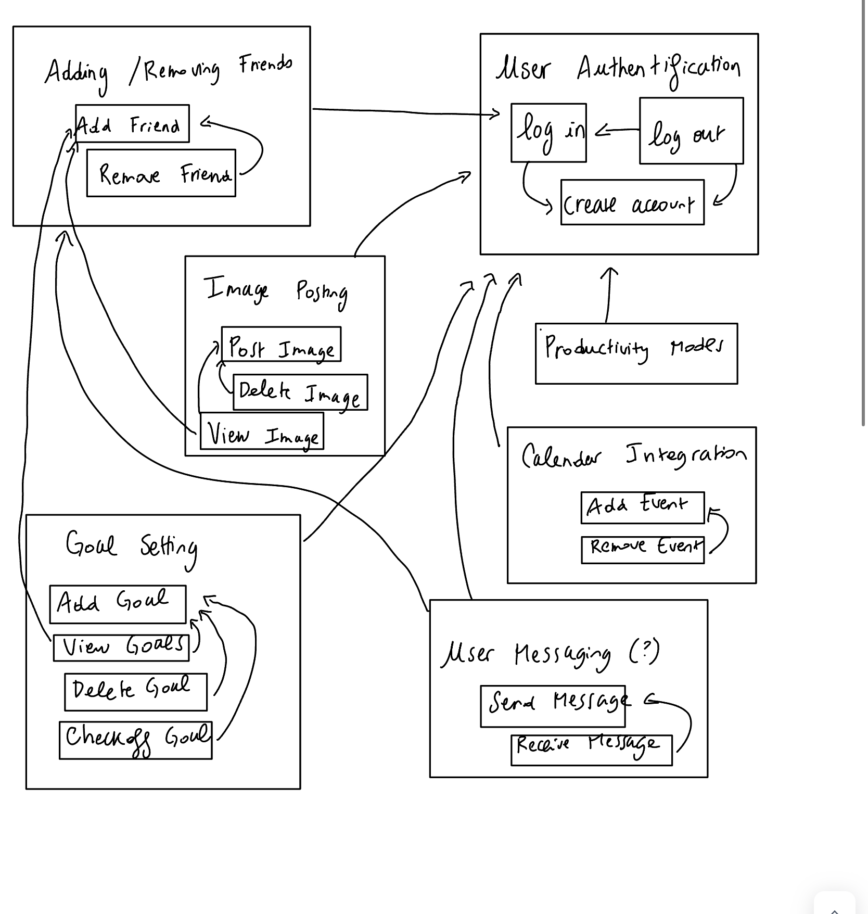
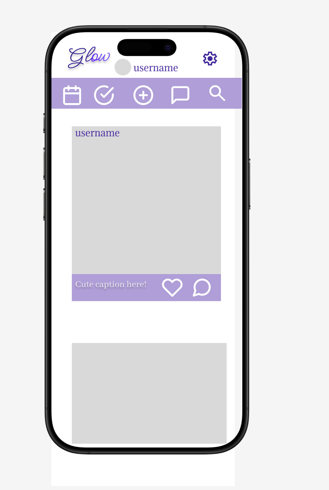
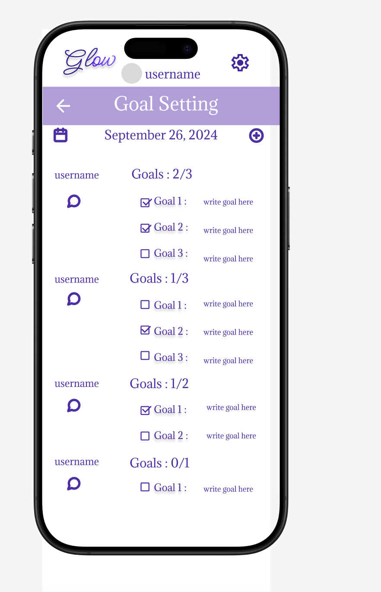
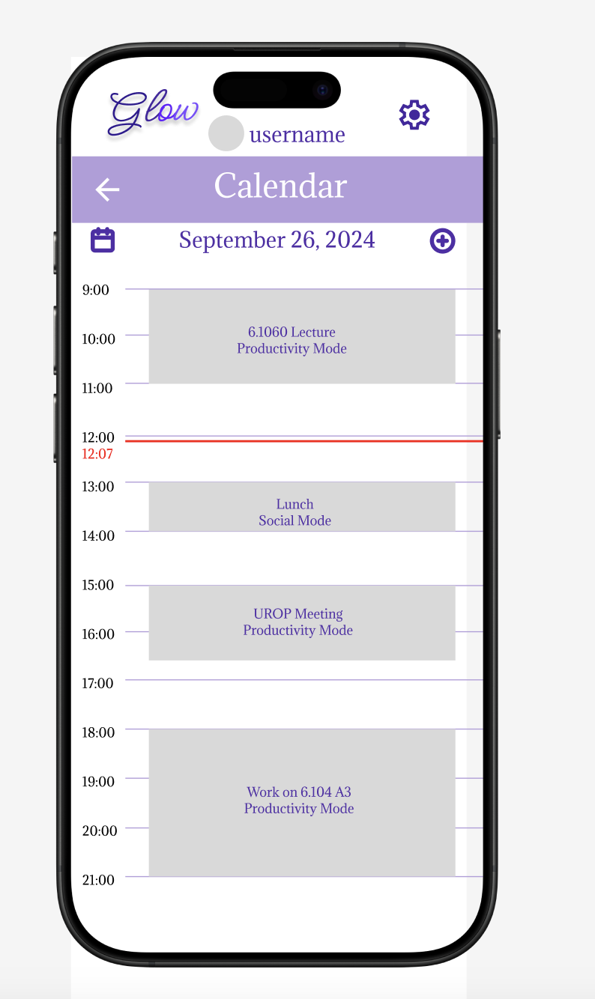
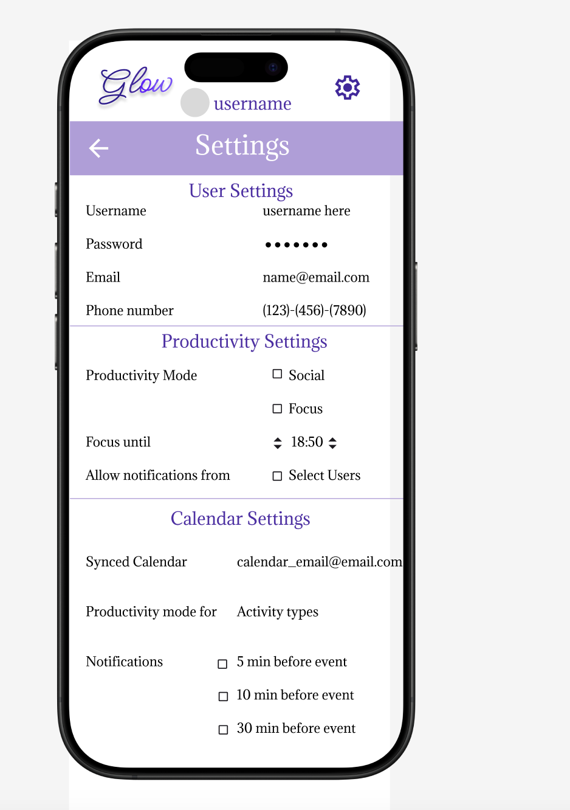

# Assignment 3

## Pitch

Introducing Glow – a social media productivity accountability platform that combines meaningful connections with the productivity you need. Designed for individuals seeking a social experience that motivates them in their daily life, like students and young professionals, Glow is perfect for those who want to stay connected with friends and family while maintaining focus on their personal and professional goals.\
Glow fosters positive interactions through posts and an interface that encourages genuine, supportive relationships. Whether you’re sharing moments of joy, catching up with friends, or finding motivation from your circle, Bright Connect ensures that your time spent online is both fulfilling and productive.
The key features of Glow include a Focus Mode, which allows users to import their schedules and limit app access during work, classes, or times of focus, helping them stay on track. 
Another feature is the Goal Sharing feature, which lets users post goals for the day or long term, and interact with other people's goals for accountability.
Other features include sharing posts like images and videos and commenting on people's posts in the goal of encouraging one another.
With a focus on meaningful interaction and personal growth, Glow empowers users to maintain strong relationships while prioritizing their well-being and productivity, so users can glow from within!

## Functional Design
### Concept 1 : Adding / Removing Friends 
Users can look up other users and add them as friends so that they can see each other's posts and goals, as well as (potentially) message each other. They would do this by clicking a search bar, typing in a username, clicking their profile, and clicking "Add friend".
### Concept 2 : Image Posting

Users can post images or other content to their profile by selecting the content from their laptop or phone (depending where the app is being used). Theyb do this by selecting the + operator on the screen, selecting selecting a photo from their personal images on their device, adding a caption, and clicking post. Users can delete posts, similarly to how we saw in the most recent preparation material.

### Concept 3 : Productivity Modes
Users can switch between productivity modes, which are focus mode and social mode. In social mode, users can view all posts from friends and themselves, all goals from friends and themselves, their calendar and their messages (if implemented). In other words, they have full functionality implemented. In focus mode, they have an alert on their homepage indicating until what time they are in focus mode, and cannot see any posts. The only page that is visible is their calendar page. Users can either program these modes manually when adding individual events to their calendar, or through their settings. If messaging is included in the final implementation, settings also include who can message the user while they are in focus mode.

### Concept 4 : Calendar Integration
Users can view their calendar for the day, and add events to their calendar for the day. When adding an event, they can choose a start time, end time, productivity mode for the event, a reminder, and if it is repeated.

### Concept 5 : Goal Setting 
Users can set goals for themselves on the daily, and mark them as completed as the day goes on. The goals settings page counts how many have been completed that day and displays that to the user. These goals are public to friends, and friends can comment on these accomplishments for encouragement.

### Concept 6 : User Authentification
Users can create an account with a username and a password, and can connect a phone number or email to the account. Once the account is created, users can log into the account with their username and password, and log out if they have already logged in. Usernames are unique and cannot be used by several different users.

### Concept 7 : User Messaging (Unsure if I will implement)
Users can message each other through the messaging page of the application, by clicking through a list of their friends and selecting the user they want to message. Users must be friends to message each other, and other users cannot view messages that two users are sending each other.

### Dependency Graph
{:width='700'}

## Wireframes
For these wireframes, I chose to show them on a phone since I am guessing a lot of people would use this app from a phone just like most other social media, but will be in the same format from a laptop.
### Wireframe 1 : Home Page
{:width='300'}

In this wireframe, we can see that posts that users are friends with can be seen on the home page, similar to TikTok, Instagram, and Facebook. Photos are meant to be used as updates into one's day, whether it be social or productivity related. Users can create their new posts by clicking the + icon at the top of the page, they can switch into their calendar page, their messaging page (might not implement, depending on if these are too many features or not), and their goal setting page (all shown in the top purple navigation bar), they can look up users, and they can switch into their settings page as well. Users can comment on photos that are posted and can react by liking a post for support, but like counts are not shown. The name of the app, Glow, is shown at the top of the screen, and the user's profile picture and username are displayed to the right of the app logo. 

### Wireframe 2 : Goal Setting Page
{:width='300'}

In this wireframe, we can see that people can set new goals in their goals page with the + icon, and check them off over the course of the day. These are public only to friends of the user, and friends can comment on these goals to encourage them, or give them feedback, for example if they are over exerting themselves. The goals page shows these goals by username, and displays how many have been completed by each user. Only the user that created the goal can check it off as being completed.

### Wireframe 3 : Calendar Page
{:width='300'}

In this wireframe, we see the calendar page of the app. In this page, users can add new events to their calendar. The initial idea is to be able to sync one's calendar (Google Calendar, Apple Calendar, etc) to this app to not have to duplicate all events. However, if this is too complicated, the app may just feature events that have been manually inputed. During input of an event, users can select the start time, end time, productivity mode (focus or social), and more. These events show up in chronological order like in mosts virtual calendars, and there is a bar showing the current time to be able to visualize when in the day the user currently is.

### Wireframe 4 : Settings Page
{:width='300'}
In this wireframe, we see the settings page of the app. Here, the user can change their username as long as it is not already taken, can modify their password, and their profile picture. In the next section, they can switch between productivity modes manually if something not scheduled comes up. During focus mode, the app usage is limited, so users cannot view posts or messages unless they are in allowed users. Finally, they can also modify calendar settings, like linking a calendar (if possible to implement).

## Design Tradeoffs

One first design decision I made was weather to include more specific features that I like from other apps, like saving posts into collections, making feeds specific to group chats, and more. After feedback from A2, I ended up deciding to strip away some of this functionality and narrow down the group of people I am targeting and the goal of my app, which is now just an app to create a space for people to post about their day, their goals, and stay on track productivity wise, so my features are more limited than some other social media apps like Instagram, for example.\
A second design decision I made was whether to make the goal setting feature public or private. On the one hand, making it public and allowing people to comment on people’s goals could invite negativity if people have bad intentions, or make people feel bad about themselves if they are not accomplishing as much as other users/friends they are connected to. However, keeping in mind that one of the goals of my app is accountability and encouragement, and that it is a social media app, this is not really possible without having these goals and pictures public.\
A third design decision I made was to what extent users should still be able to use the app during their time on focus mode. For instance, if focus mode is mistakenly enabled for a period of time, should they be able to change settings? Or if they just want to cancel the focus mode because they want to see what their friends are up to? The final design decision was made because of the goal of the app: to increase productivity. The only page that is available during focus mode is the calendar, so people cannot change out of focus mode until the scheduled end time. If people really need to be in touch with another user (if messaging is implemented), this can be done in the settings.This is done because in a lot of social media apps, time limits are way too easy to cancel and break, and since this is a productivity app this would go against the concept of the app.

