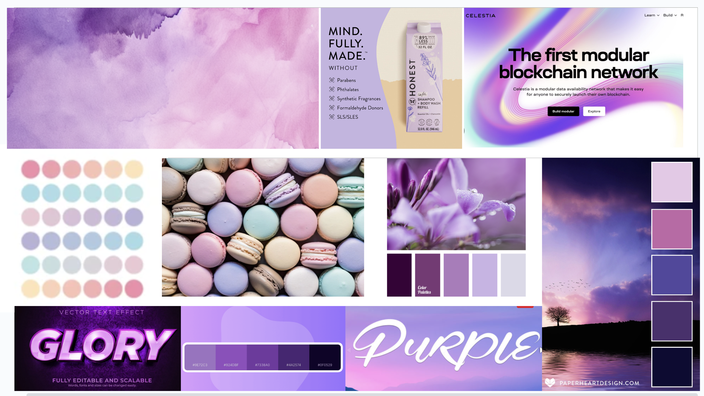
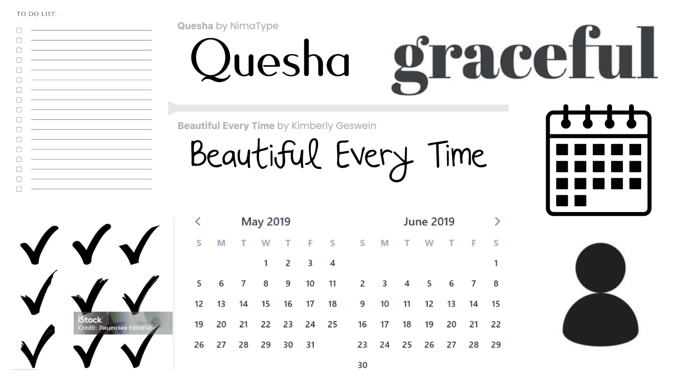

# Assignment 5

## Heuristics for evaluation

### Usability Criteria

#### Discoverability:
- This app is designed for students or young professionals seeking to get organized, be productive, and encourage others in this endeavour. Therefore, it is extremely important for users not to be wasting time on the logistics of the interface, and for them to understand quickly how things work.
- The focus mode may go againt this heuristic, because I am not allowing users to go out of the focus mode easily, since the goal is when they are in focus mode, they do not want to use the app at all.
#### Pleasantness:
- My app is meant for people seeking productivity, so this app should be easy to use, pleasant to look at, and almost calming to feel they can encourage others and get things done peacefully.
- This may sometimes conflict with my discoverability and mapping principles, since I want it to be a very efficient app and not there to be any confusion with how to do things (some of this clarity in buttons and pages may not be so aesthetically pleasing).

### Physical Heuristics

#### Mapping
- Since one of my main priorities is for this app to be easy to use so users do not lose time, mapping will be very important, especially since I have a lot of different pieces of functionality within my app (calendar, posts, goals, etc) that need to be easily accessible. 
- I want the calendar page to be very straighforward, and the icons on the page to give the user a clear image of what element does what.

#### Situational context
- Situational context will be extremely important because I am going to be implementing the feature where if the user is in focus mode, nothing should show up (or very minimal functionality), so the app has to adapt to the context that the user will have provided beforehand.
- This will definitely be more challenging to make aesthetically pleasing. I will need to think about how to adapt to the user's content in a way that a blank page does not simply appear.

### Linguistic Level
#### Speak a user’s language\
- I am hoping to have very direct messages conveying the user's current mode (focus vs social), and when errors occur, to minimize time being lost trying to figure the app out. Before, in my wireframes, I had not really planned out how I would convey the message of the focus mode being activated, for example, so I will have to figure that out.

#### Consistency
- I want my app to look as consistent and thorough as possible with cute details that will be repeated accross different pages.
- I think this is reflected in my wireframes as I reused my logos, fonts, and colours.
- I think this goes along with my goal of having the app being as pleasant to use visually as possible.

## Visual Design Study

{:width='600'}

This first slide shows my color theme, which I wanted to be like a light purple, pastel theme with some darker accents. The central row of this slide especially show my inspiration for that. I also included some inspiration for the writing of the title of my app in the botton left, i wanted a shiny looking purple with a more calming tone, since this is a productivity app. I also liked the font on the two top right and botton images, but will not necessarily use them depending on how limited I am with consistency.
{:width='600'}
This second slide includes more technical elements. I like the simplicity and font of the to do list I included and how straightforward it was to understand since mapping and discoverability were two of my main heuristics. The v-calendar I also really like for the same reason of simplicity. The fonts I included are pretty for the pleasantness heuristic and also in my opinion calming, so that the goal of stress reducing productivity is achieved. Finally, I included some icons that I thought would work well with my navigation bar.

## App Description

I have a profile page, a goals page, a calendar page that shows events for the selected day, a settings page that can activate and deactivate focus mode.

## Deployment Challenges

Since I used a 3rd party calendar packages and I have been having some personal issues (I emailed staff about this), I was not succesfully able to deploy my app, although it seems to work fine on my end. I spent a lot of time on this assignment so hopefully, the work I did can still be taken into account. So sorry for the inconvenience.