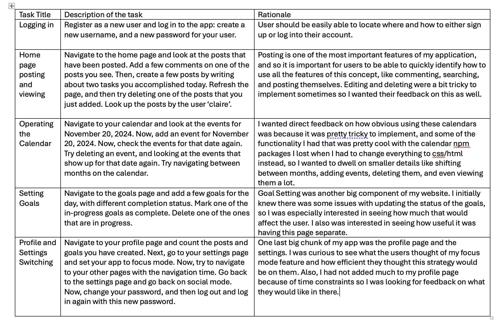

# Assignment 6

## Task List:

{:width='1100'}

## First User Test: Maximiliano Ramirez 
The first user test I conducted was with one of my friends, Maximiliano Ramirez, from MIT that I conducted one of the first interviews for A1 with, which I thought would be a good idea because he already somewhat knew about the direction and the goal about my application, and also was interested in being a user of a productivity app like this on the student side. 
The first task of registering as a new user / logging in went smoothly, although he did mention that having a button for the login that said register or login instead of login would be helpful, so that users who do not have an account yet don’t feel lost about how to login for the first time. 
When he had logged in, he at first seemed a bit confused that that was the home page, and tried to click on the home ion in the navigation bar, which just led him back to the same page (nothing happened).
Everything else with posting went well, but he seemed confused after looking up the user to see their posts how to go back to not filtering anymore. Since there wasn’t a specific button to do so, he just tried deleting the text in the text box and tried refreshing the page.
When he first navigated to the calendar page, he was confused how to show events for a date. Also, since nothing was shown, he first tried adding an event to the calendar with the first interactive calendar instead of the second one, even though I thought it was clear-ish that since the first calendar is before the ‘add an event’ section, you would select it below that. That indicated to me that maybe I should not have two interactive calendars on that page, but only one. Or maybe, I could only have the day selector pop up when the user is actually adding an event, and not just always have it show. The last task list went well, and he seemed happy with the focus mode feature and asked about if the events automatically add focus mode (as in, if you add an event from 8PM to 9PM and indicated it to be focus mode, if you open the app on that day between those times, if focus mode would be activated), and unfortunately that was one of the features that I did not have time to implemement. 
All in all, this user test went well but there were a few key features that I would change if I were to make another  version of this app.

## Second user test: Daymé Delgado

My second user test was with Daymé Delgado, a young professional working as a robotics engineer in Boston, and recently graduated from MIT. She also struggles with productivity and looks for motivation through interacting with others, so would probably be a good user for this application.
She seemed to be able to do all the tasks fairly easily with no hesitation or questions but got pretty confused when it came to the goals. She saw the ‘Friends’ Goals’ sections and was confused why there was nothing there. I later realized that I had made an implementation error with how that section of the goals were implemented. Next, she also had the same confusion with making events and selecting the wrong calendar. She also seemed very confused when she actually managed to add the event, because nothing actually showed up on the calendar, and the event was not visible so she had to refresh the page to actually see it, but when she refreshed the page, the date that she had selected to see was no longer selected, so she had to reselect it. I think this along with the comments from the previous user test indicated that my goals page is not ideal for user experience because the two calendars are slightly confusing and also don’t refresh in a way that is clear to the user that they have completed the task they wanted to. She liked the focus mode feature a lot but commented that it is pretty easy to turn off and that might go against the intended purpose. She also seemed confused when she tried to update her password, and said that when she typed it, she was not sure if she was doing anything wrong because the color on the button to update it did not change color and it was also a very similar color to the background, so it looked like it was not ‘pressable’ from what she said.
All in all I think this user test made me aware of how smaller design choices that seem 

## Bullet Point List
1) Friends’ goals not updating: Currently, the friends’ goals page does not update as people add posts. This is happening because I forgot to create a separate method for getting all the goals instead of just the current user's. This is a simple implementation fix so people can keep track with their friends, and I actually managed to fix this so that that section of the application does not just sit empty. This is a conceptual bug and it is major because it is a main feature of my website that is not currently working, even though it doesn't affect general functionality so it is not blocking anything else.
2) Adding clearer instructions on the page when users are not logged in: Adding two separate forms for registering or logging in, so people know where exactly to go for both of those tasks. I also didn't have time to make that welcome page very nice with the design or descriptive in general, so making that better (maybe adding a small description of the app?) would be good. This is a linguistic bug, and it is minor because it does not actually affect anything technical in the application, but it is an annoyance because people may take longer to find the registration form or just be confused/not like the front page, which is important.
3) Changing Calendar Page disposition: currently, there are two calendars that the user can interact with, and I have noticed that this is very confusing. One should either be way smaller in the create event form so people can clearly identify that it is for picking a date, only show up when a user decides to create an event, or they should be integrated together (AKA if someone selects a date, you can create an event for that date and at the same time see the events for it). This is a conceptual bug that is moderate to major because it definitely was a constant source of issues during this user testing.
4) Changing some of the color scheme: For some buttons, it was confusing when the user had added suffient information for the form in question to work. Some colors were too light, and some were just too dynamic and colorful in general. This is a minor physical bug because it just caused slight friction.
5) Making refreshing more efficient: Several times, I noticed my users getting confused about what was happening because of refreshs (goals, calendar). I would make refreshing more dynamic for some of the tasks so that this does not happen. I would say this is a major fix to make.
